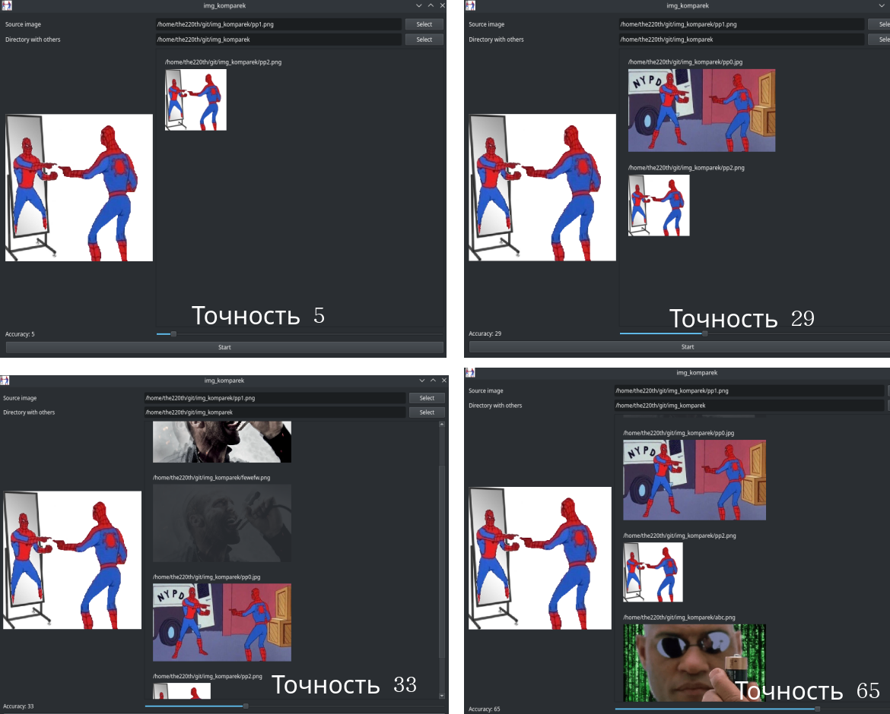

# img_komparek


Сравнивает картинки.

# Зависимости

Нужны пакеты: `Pillow` и `PyQt5`.

``` bash
> pip3 install Pillow PyQt5
``` 

# Использование

Запустите

``` bash
> python img_komparek.py
```

Выберите `Source image` - это фотография, которая будет сравниваться с остальными.

Выберите `Directory with others` - это директория, где лежат фотографии (во вложенных папках тоже будет искать).

Укажите точность `accuracy`: выбирайте не более 5, 10 максимум. 

Вот сравнение выбора разной точности:



Нажмите `Start`. 